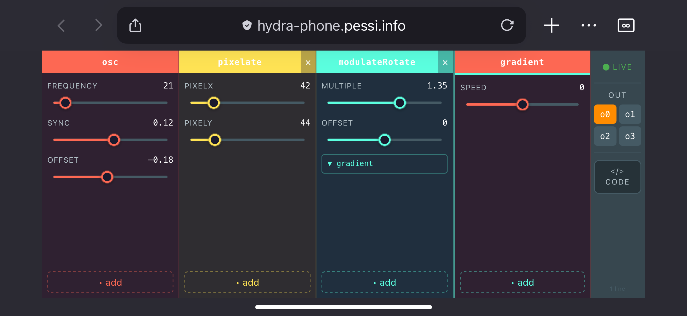

# Hydra-phone

This is a graphical, block-based smartphone UI for [Hydra live coding video synth](https://hydra.ojack.xyz). The project is in an early phase, so not all of the Hydra features are implemented yet. The UI is built with React in TypeScript. The communication between the first device and the smartphone is established using WebSockets, after which a WebRTC p2p connection is used for the data.

## Usage

Got to the [demo page](https://hydra-phone.pessi.info/) and scan the QR code with a smartphone. Your smartphone will load the UI, and the hydra code output will show on your first device's screen.

## What works

- establishing a hydra session
- source, geometry, color, blend, and modulate functions
- source type can be changed
- the source type can be changed and functions can be chained within the nested blend and modulate functions
- function argument values can be changed with sliders
- resulting code can be viewed

## What doesn't work yet

- passing an array of values as an argument
- chaining functions on array arguments
- custom functions as input
- using multiple outputs
- external sources
- synth settings

## Feature plans

- import hydra code and get a matching visual UI representation
- store and retrieve sessions
- session autosave
- use smartphone devices as input (micropohone, camera, gyroscope, accelerometer)
- multiplayer mode

## Hydra resources

- [Hydra live coding video synth](https://hydra.ojack.xyz)
- [The official documentation](https://hydra.ojack.xyz/docs/docs/reference/)
- [Hydra Book](https://hydra-book.glitches.me/)
